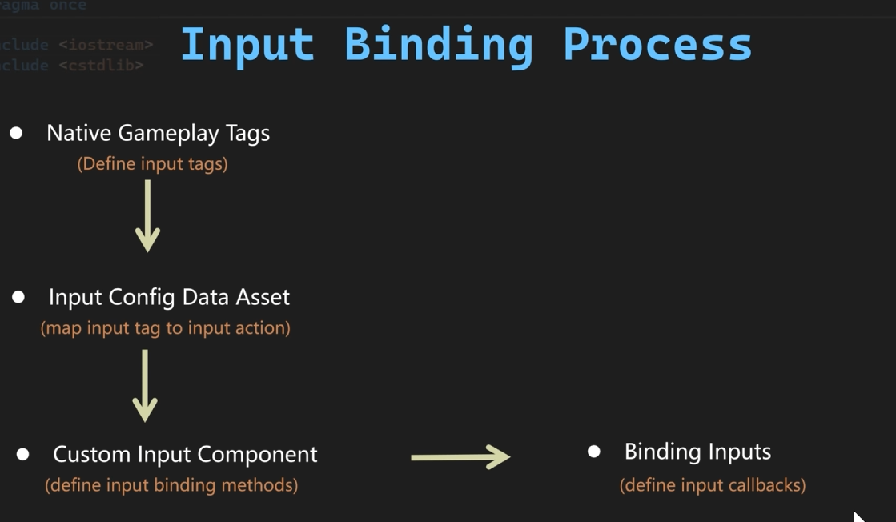

# Gameplay Tags in Unreal Engine

## Overview

Gameplay Tags are a powerful hierarchical labeling system in Unreal Engine that allows you to categorize and identify gameplay concepts using string-based tags. They provide a flexible, data-driven way to mark and query gameplay objects, abilities, states, and events without hard-coding enums or constants.

## What are Gameplay Tags?

Gameplay Tags are hierarchical labels formatted with dot notation (e.g., `Character.State.Stunned`, `Weapon.Type.Melee.Sword`). They are:

- **Hierarchical**: Tags use a parent-child structure separated by dots
- **Data-Driven**: Defined in configuration files or data tables
- **Type-Safe**: Validated at edit time and compile time
- **Performance-Optimized**: Stored as FNames internally with fast comparison
- **Network-Friendly**: Efficiently replicated across the network

## Why Use Gameplay Tags?

### Advantages

1. **Flexibility**: Add new tags without changing code or recompiling
2. **Hierarchy**: Query parent tags to match all children (e.g., `Weapon.Type` matches all weapon types)
3. **Organization**: Keep related concepts grouped logically
4. **Designer-Friendly**: Non-programmers can work with tags in the editor
5. **Debugging**: Human-readable strings make debugging easier than numeric IDs
6. **Network Efficiency**: Tags are replicated efficiently with built-in support

### Common Use Cases

- Character states (stunned, invincible, flying)
- Ability requirements and effects
- Damage types and resistances
- Item categories and properties
- Quest and objective tracking
- Buff/debuff effects
- AI behavior triggers
- Input action mapping

## Setting Up Gameplay Tags

### 1. Configure Tag Sources

Tags are typically defined in one of these locations:

**DefaultGameplayTags.ini** (Project Settings)
```ini
[/Script/GameplayTags.GameplayTagsSettings]
+GameplayTagList=(Tag="Character.State.Alive",DevComment="Character is alive")
+GameplayTagList=(Tag="Character.State.Dead",DevComment="Character is dead")
+GameplayTagList=(Tag="Weapon.Type.Melee.Sword",DevComment="Sword weapon type")
+GameplayTagList=(Tag="Weapon.Type.Ranged.Bow",DevComment="Bow weapon type")
```

**Data Tables** (more flexible for large tag sets)
- Create a Data Table with row structure `GameplayTagTableRow`
- Add tags with descriptions in the editor

### 2. Access in Editor

1. Open **Project Settings > Gameplay Tags**
2. View and manage all tags
3. Import from data tables or INI files
4. Add tags manually

## Using Gameplay Tags in C++

### Include Required Headers

```cpp
#include "GameplayTagContainer.h"
#include "GameplayTagsManager.h"
```

### Tag Types

```cpp
// Single tag
FGameplayTag MyTag;

// Container for multiple tags (like a set)
FGameplayTagContainer MyTags;

// Tag query (for complex matching logic)
FGameplayTagQuery MyQuery;
```

### Creating and Assigning Tags

```cpp
// Request a tag from the manager
FGameplayTag StunnedTag = FGameplayTag::RequestGameplayTag(FName("Character.State.Stunned"));

// Check if tag is valid
if (StunnedTag.IsValid())
{
    // Tag exists
}

// Create a container with multiple tags
FGameplayTagContainer CharacterTags;
CharacterTags.AddTag(StunnedTag);
CharacterTags.AddTag(FGameplayTag::RequestGameplayTag(FName("Character.State.Alive")));
```

### Tag Comparisons

```cpp
// Exact match
if (Tag1.MatchesTagExact(Tag2))
{
    // Tags are identical
}

// Hierarchical match (matches tag or any parent)
if (Tag1.MatchesTag(Tag2))
{
    // Tag1 matches Tag2 or is a child of Tag2
    // Example: "Weapon.Type.Melee.Sword".MatchesTag("Weapon.Type") returns true
}

// Check if container has a tag
if (CharacterTags.HasTag(StunnedTag))
{
    // Container has the stunned tag
}

// Check if container has any tags from another container
if (CharacterTags.HasAny(OtherTags))
{
    // At least one tag matches
}

// Check if container has all tags from another container
if (CharacterTags.HasAll(RequiredTags))
{
    // All required tags are present
}
```

### Container Operations

```cpp
FGameplayTagContainer MyTags;

// Add tags
MyTags.AddTag(StunnedTag);
MyTags.AddTagFast(AnotherTag); // Faster, no uniqueness check

// Remove tags
MyTags.RemoveTag(StunnedTag);

// Clear all
MyTags.Reset();

// Combine containers
MyTags.AppendTags(OtherTags);

// Filter
FGameplayTagContainer FilteredTags = MyTags.Filter(FilterQuery);

// Count
int32 NumTags = MyTags.Num();

// Iterate
for (const FGameplayTag& Tag : MyTags)
{
    UE_LOG(LogTemp, Log, TEXT("Tag: %s"), *Tag.ToString());
}
```

## Using Gameplay Tags in Blueprints

Gameplay Tags are fully supported in Blueprints:

1. **Variable Types**: Add `Gameplay Tag` or `Gameplay Tag Container` variables
2. **Tag Picker**: Use the dropdown to select tags visually
3. **Comparison Nodes**: `MatchesTag`, `HasTag`, `HasAny`, `HasAll`
4. **Container Nodes**: `Add Tag`, `Remove Tag`, `Append Tags`
5. **Event Binding**: React to tag changes using delegates

## Best Practices

### Naming Conventions

- Use clear, descriptive names
- Follow a consistent hierarchy (e.g., `Category.Subcategory.Specific`)
- Start with broad categories, get more specific
- Use PascalCase for each segment
- Avoid abbreviations unless universally understood

Example hierarchy:
```
Character.State.Alive
Character.State.Dead
Character.State.Stunned
Character.Class.Warrior
Character.Class.Mage
Weapon.Type.Melee.Sword
Weapon.Type.Melee.Axe
Weapon.Type.Ranged.Bow
Damage.Type.Physical
Damage.Type.Fire
Damage.Type.Ice
```

### Organization Tips

1. **Plan Your Hierarchy**: Design the tag structure before implementing
2. **Document Tags**: Add dev comments explaining each tag's purpose
3. **Limit Depth**: Keep hierarchies 3-5 levels deep maximum
4. **Group Related Concepts**: Put similar systems under the same parent tag
5. **Centralize Definitions**: Keep tags in version control (INI or data tables)

### Performance Considerations

- Tags are very fast to compare (FName comparison)
- Containers use sets internally (O(log n) lookup)
- `AddTagFast` skips duplicate checking if you know the tag is unique
- Tag queries are cached and optimized
- Network replication is efficient with built-in compression

### Common Pitfalls

1. **Typos**: Always use `RequestGameplayTag` with constants or verified strings
2. **Over-Nesting**: Too many levels makes tags unwieldy
3. **Dynamic Tags**: Don't create tags at runtime; define them in data
4. **Wrong Comparison**: Use `MatchesTag` for hierarchical, `MatchesTagExact` for exact
5. **Not Checking Validity**: Always verify tags exist before using them

## Integration with Gameplay Ability System (GAS)

Gameplay Tags are deeply integrated with the Gameplay Ability System:

- **Ability Tags**: Identify and categorize abilities
- **Activation Requirements**: Tags required/blocked for activation
- **Cooldown Tags**: Applied during cooldown periods
- **Effect Tags**: Tags granted/required by gameplay effects
- **Asset Tags**: Tags on ability assets
- **Blocking Tags**: Prevent abilities while certain tags are active

Example:
```cpp
// In a Gameplay Ability
UGameplayAbility::GetAbilitySystemComponentFromActorInfo()->AddLooseGameplayTag(StunnedTag);
```

## Debugging Gameplay Tags

### Console Commands

```
GameplayTags.PrintReport - Print all registered tags
showdebug AbilitySystem - Show active tags on characters (with GAS)
```

### Logging

```cpp
UE_LOG(LogTemp, Log, TEXT("Character has tags: %s"), *CharacterTags.ToStringSimple());
```

### Editor Tools

- **Gameplay Tag Manager**: View all tags in Project Settings
- **Blueprint Debugger**: Watch tag variables during PIE
- **Gameplay Debugger**: Show active tags on selected actors (F8 key)

## Example: Character State System

```cpp
// AHHeroCharacter.h
UPROPERTY(BlueprintReadOnly, Category = "GameplayTags")
FGameplayTagContainer CharacterTags;

// AHHeroCharacter.cpp
void AAHHeroCharacter::BeginPlay()
{
    Super::BeginPlay();

    // Add initial alive state
    FGameplayTag AliveTag = FGameplayTag::RequestGameplayTag(FName("Character.State.Alive"));
    CharacterTags.AddTag(AliveTag);
}

void AAHHeroCharacter::ApplyStun(float Duration)
{
    FGameplayTag StunnedTag = FGameplayTag::RequestGameplayTag(FName("Character.State.Stunned"));

    if (!CharacterTags.HasTag(StunnedTag))
    {
        CharacterTags.AddTag(StunnedTag);

        // Set timer to remove stun
        GetWorld()->GetTimerManager().SetTimer(
            StunTimerHandle,
            [this, StunnedTag]()
            {
                CharacterTags.RemoveTag(StunnedTag);
            },
            Duration,
            false
        );
    }
}

bool AAHHeroCharacter::CanPerformAction() const
{
    // Check if character is not stunned or dead
    FGameplayTag StunnedTag = FGameplayTag::RequestGameplayTag(FName("Character.State.Stunned"));
    FGameplayTag DeadTag = FGameplayTag::RequestGameplayTag(FName("Character.State.Dead"));

    return !CharacterTags.HasTag(StunnedTag) && !CharacterTags.HasTag(DeadTag);
}
```

## This is our Hierachy of bindings and components



## Additional Resources

- [Official Unreal Engine Documentation: Gameplay Tags](https://docs.unrealengine.com/en-US/ProgrammingAndScripting/Tags/)
- [Gameplay Ability System Documentation](https://docs.unrealengine.com/en-US/InteractiveExperiences/GameplayAbilitySystem/)
- Source Code: `Engine/Source/Runtime/GameplayTags/`

## Summary

Gameplay Tags provide a robust, flexible system for categorizing and identifying gameplay elements. By using a hierarchical, data-driven approach, they enable designers and programmers to work together efficiently while maintaining clean, maintainable code. When combined with the Gameplay Ability System, they become even more powerful for implementing complex gameplay mechanics.
