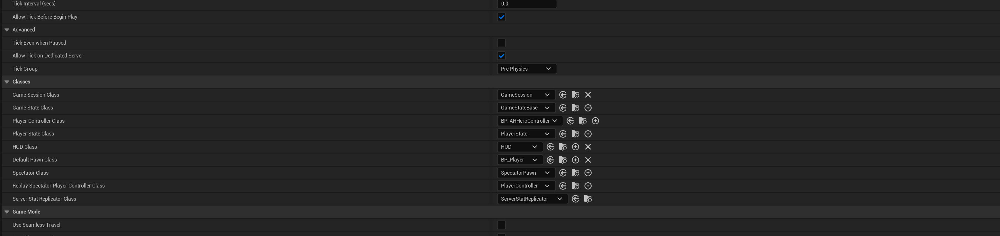

# Project Setup

## Overview
This guide covers the initial setup steps required to configure the AshenHorde project.

## Blueprint Creation

### 1. Create Core Blueprints
Create blueprints from the following C++ classes:

- **Hero Character** - The player character class
- **Hero Controller** - The player controller class
- **Game Mode** - The game mode class

### 2. Configure Game Mode Blueprint
Once the blueprints are created, add them to the Game Mode blueprint configuration:



The Game Mode blueprint should reference:
- Default Pawn Class: Hero Character Blueprint
- Player Controller Class: Hero Controller Blueprint

## Project Settings Configuration

### Maps & Modes Settings
Configure the project's default maps and game modes in **Project Settings > Maps & Modes**:

#### Default Modes
- **Default GameMode**: `BP_AHGameMode`
  - This is the game mode blueprint created from your C++ game mode class

#### Default Maps
- **Editor Startup Map**: `PlayGround`(Only for testing)
  - The map that opens when you launch the Unreal Editor
- **Game Default Map**: `PlayGround`(Only for testing)
  - The map that loads when playing the game

#### Game Instance
- **Game Instance Class**: `GameInstance`
  - The game instance class for persistent game state

These settings are saved in `DefaultEngine.ini`.

### Engine Input Settings
Configure the input component class in **Project Settings > Engine > Input**:

#### Default Classes
- **Default Input Component Class**: `AHInputComponent`
  - This is the custom input component class that handles enhanced input functionality
  - Provides the foundation for the game's input system

These settings are saved in `DefaultEngine.ini`.

## Enhanced Input System Setup

The project uses Unreal Engine's Enhanced Input System with a gameplay tag-based architecture for flexible input handling.

### 1. Create Gameplay Tags for Input

Navigate to **Project Settings > Gameplay Tags** and create the following tags:

```
Input.Move
Input.Look
```

These tags are used to identify and bind input actions in a data-driven way.

### 2. Create Input Actions

Create the following Input Action assets in your Content folder (recommended location: `Content/Characters/Players/Input/Actions/`):

- **IA_Move** - Input Action for character movement
  - Value Type: Axis2D (for 2D movement input)

- **IA_Look** - Input Action for camera look/rotation
  - Value Type: Axis2D (for mouse/stick look input)

### 3. Create Input Mapping Context

Create an Input Mapping Context asset (recommended location: `Content/Characters/Players/Input/`):

- **IMC_Default** - The default input mapping context
  - Add mappings for keyboard/mouse and gamepad
  - Map physical inputs (WASD, Mouse, Gamepad Sticks) to the Input Actions created above

Example mappings:
- **IA_Move**: W/A/S/D keys, Left Gamepad Stick
- **IA_Look**: Mouse Delta, Right Gamepad Stick

### 4. Create Input Configuration Data Asset

Create a Data Asset of type `DataAsset_InputConfig` (recommended location: `Content/Characters/Players/`):

- **DA_InputConfig** - Maps gameplay tags to input actions

Configure the data asset:
- **Default Mapping Context**: `IMC_Default`
- **Native Input Actions** (array):
  - Element [0]:
    - Input Tag: `Input.Move`
    - Input Action: `IA_Move`
  - Element [1]:
    - Input Tag: `Input.Look`
    - Input Action: `IA_Look`

This data asset serves as the central configuration that connects:
1. Gameplay Tags (used in code for binding)
2. Input Actions (what should happen)
3. Input Mapping Context (physical input mappings)

### How It Works

The `UDataAsset_InputConfig` class provides:
- A structure (`FAHInputActionConfig`) that pairs gameplay tags with input actions
- A `FindNativeInputActionByTag()` method to look up input actions by their tag
- Reference to the default mapping context

This architecture allows you to:
- Bind inputs in C++ using gameplay tags instead of hard-coded references
- Change input mappings without modifying code
- Support multiple input configurations (e.g., different control schemes)
- Keep input configuration data-driven and designer-friendly

## Additional Configuration
Additional setup steps will be documented here as the project evolves.